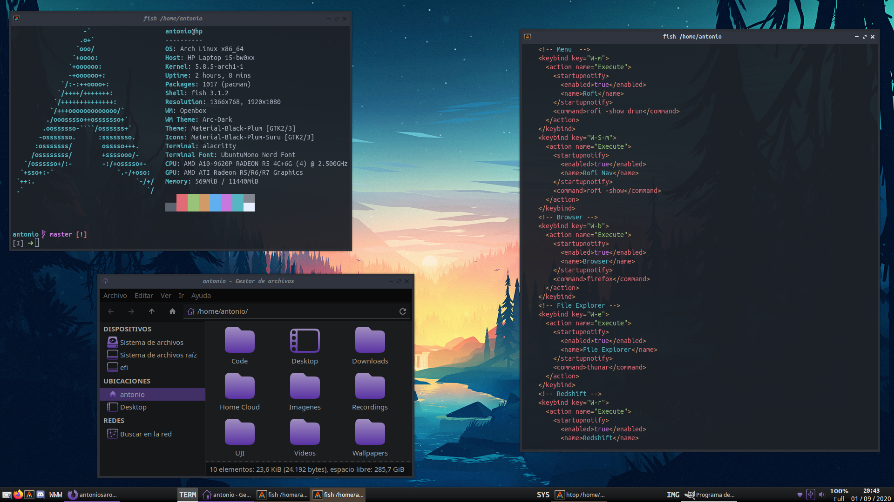

# Dotfiles & Configs


Idioma
🇪🇸
[🇺🇸](https://github.com/antoniosarosi/dotfiles)

Esta guía todavía **no está completa**, para la versión completa y actualizada
[échale un vistazo a la guía en inglés](https://github.com/antoniosarosi/dotfiles).

# Table of Contents

- [Resumen](#resumen)
- [Instalación de Arch Linux](#instalación-de-arch-linux)
- [Inicio de sesión y gestor de ventanas](#inicio-de-sesión-y-gestor-de-ventanas)
- [Configuración básica de Qtile](#configuración-básica-de-qtile)
- [Utilidades básicas del sistema](#utilidades-básicas-del-sistema)
  - [Fondo de pantalla](#fondo-de-pantalla)
  - [Fuentes](#fuentes)
  - [Audio](#audio)
  - [Monitores](#monitores)
  - [Almacenamiento](#almacenamiento)
  - [Redes](#redes)
  - [Systray](#systray)
  - [Xsession](#xsession)
- [Otras configuraciones y herramientas](#otras-configuraciones-y-herramientas)
  - [AUR helper](#aur-helper)
  - [Media Transfer Protocol](#media-transfer-protocol)
  - [Explorador de archivos](#explorador-de-archivos)
  - [Tema de GTK](#tema-de-gtk)
  - [Multimedia](#multimedia)
  - [Empieza a hackear](#empieza-a-hackear)
- [Galería](#galería)
  - [Qtile](#qtile)
  - [Spectrwm](#spectrwm)
  - [Openbox](#openbox)
  - [Xmonad](#xmonad)
  - [Dwm](#dwm)
- [Atajos de teclado](#atajos-de-teclado)
  - [Ventanas](#ventanas)
  - [Apps](#apps)
- [Software](#software)

# Resumen

Esta guía te llevará por todos los pasos necesarios para construir un entorno de
escritorio a partir de una instalación limpia basada en Arch Linux. Voy a asumir
que te manejas bien con sistemas operativos basados en Linux y sus líneas de
comandos. Ya que estás leyendo esto, asumiré también que has visto algunos
vídeos de "*tiling window managers*" en Youtube, porque ahí es donde empieza el
sinfín. Puedes elegir el gestor de ventanas que quieras, pero aquí usaremos
Qtile, dado que fue con el que empecé yo. Esta guía es básicamente una
descripción de cómo he construido mi entorno de escritorio desde 0.

# Instalación de Arch Linux

El punto de partida de esta guía es justo después de una instalación basada en
Arch completa y limpia. La
**[Wiki de Arch](https://wiki.archlinux.org/index.php/Installation_guide)**
no te dice qué hacer después de establecer la contraseña del superusuario,
sugiere instalar un cargador de arranque, pero antes de eso yo me aseguraría de
tener internet:

```bash
pacman -S networkmanager
systemctl enable NetworkManager
```

Ahora puedes instalar un cargador de arranque y probarlo de forma "segura", así
es como se haría en hardware moderno,
[suponiendo que has montado la partición efi en /boot](https://wiki.archlinux.org/index.php/Installation_guide#Example_layouts):

```bash
pacman -S grub efibootmgr os-prober
grub-install --target=x86_64-efi --efi-directory=/boot
os-prober
grub-mkconfig -o /boot/grub/grub.cfg
```

Ahora puedes crear tu usuario:

```bash
useradd -m username
passwd username
usermod -aG wheel,video,audio,storage username
```

Para tener privilegios de superusuario necesitamos sudo:

```bash
pacman -S sudo
```

Edita **/etc/sudoers** con nano o vim y descomenta esta línea:

```bash
## Uncomment to allow members of group wheel to execute any command
# %wheel ALL=(ALL) ALL
```

Ahora ya puedes reiniciar:

```bash
# Sal de la imagen ISO, desmontala y extráela
exit
umount -R /mnt
reboot
```

Después de haber iniciado sesión, el internet debería funcionarte sin problema,
pero eso solo aplica si tu ordenador está conectado por cable. Si estás en un
portátil que no tiene puertos Ethernet, probablemente hayas usado
**[iwctl](https://wiki.archlinux.org/index.php/Iwd#iwctl)**
durante la instalación, pero este programa ya no está disponible a no ser que
lo hayas instalado explícitamente. Sin embargo, tenemos
**[NetworkManager](https://wiki.archlinux.org/index.php/NetworkManager)**,
así que no hay problema, para conectarte a una red inalámbrica con este software
solo debes hacer esto:

```bash
# Lista las redes disponibles
nmcli device wifi list
# Conéctate a tu red
nmcli device wifi connect TU_SSID password TU_CONTRASEÑA
```

Échale un vistazo a
[esta página](https://wiki.archlinux.org/index.php/NetworkManager#nmcli_examples)
para otras opciones proporcionadas por *nmcli*. Lo último que tenemos que hacer
antes de pensar en entornos de escritorio es instalar
**[Xorg](https://wiki.archlinux.org/index.php/Xorg)**:

```bash
sudo pacman -S xorg
```

# Inicio de sesión y gestor de ventanas

# Configuración básica de Qtile


# Utilidades básicas del sistema

## Fondo de pantalla

## Fuentes

## Audio

## Monitores

## Almacenamiento

## Redes

## Systray

## Xsession

# Otras configuraciones y herramientas

## AUR helper

## Media Transfer Protocol

## Explorador de archivos

## Tema de GTK

## Multimedia

## Empieza a hackear

# Galería
## Qtile


## Spectrwm


## Openbox


## Xmonad


## Dwm


# Atajos de teclado

## Ventanas

## Apps

# Software
